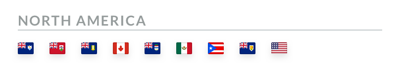
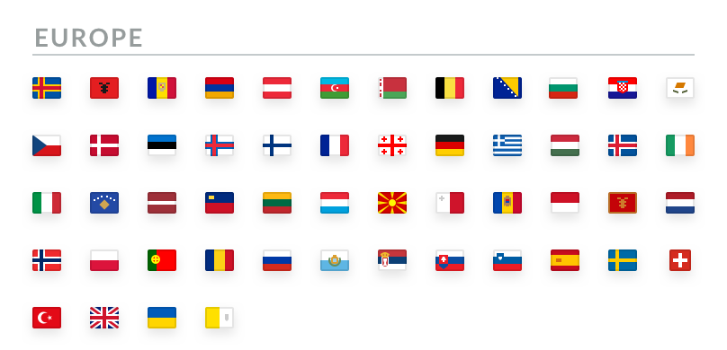
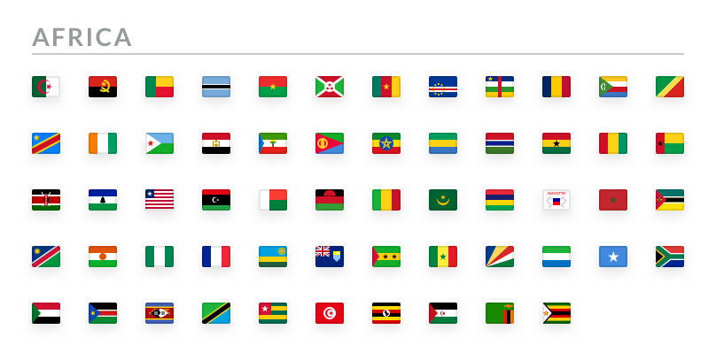
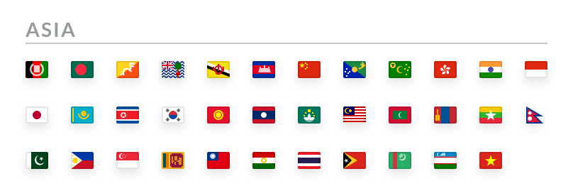
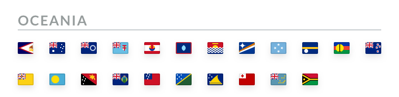
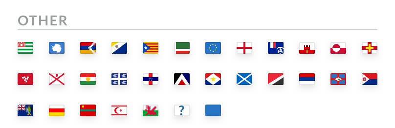

# Lightspeed Flags
An open source flag set made possible by the Lightspeed Design team. 
All flags are 16x12 and available in SVG, 1x, 2x, and 3x PNG.

The flags are also available as a Framer module and React components.

# Available flags:

